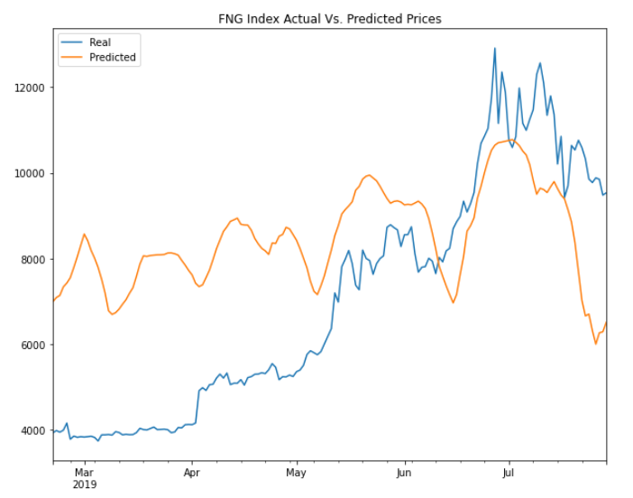

# LSTM Stock Predictor

### Background

This repository assists in the development and evaluation of deep learning models that use both [Crypto Fear and Greed Index (FNG)](https://alternative.me/crypto/fear-and-greed-index/) values and simple closing prices to compare which one provides a better signal. 

I used deep learning recurrent neural networks to model bitcoin closing prices. One model uses the FNG indicators to predict the closing price while the second model uses a window of closing prices to predict the closing price.

Steps completed:

* prepare-the-data-for-training-and-testing
* build-and-train-custom-lstm-rnns
* evaluate-the-performance-of-each-model

- - -

### Files

[Closing Prices Notebook](My_Code/lstm_stock_predictor_closing.ipynb)

[FNG Index Notebook](My_Code/lstm_stock_predictor_fng.ipynb)

- - -

### Results

> Which model has a lower loss?
> *The LSTM Stock Predictor using closing prices has a lower loss of 0.0147 compared to 0.1065 for the FNG index.* 

> Which model tracks the actual values better over time?
> *The LSTM Stock Predictor using closing prices tracks the actual values better over time.* 
>

>

> Which window size works best for the model?
*I found a window size of one predicts the price with the least amount of lag and lowest loss.*
>

- - -

### Resources

[Keras Sequential Model Guide](https://keras.io/getting-started/sequential-model-guide/)

[Illustrated Guide to LSTMs](https://towardsdatascience.com/illustrated-guide-to-lstms-and-gru-s-a-step-by-step-explanation-44e9eb85bf21)

[Stanford's RNN Cheatsheet](https://stanford.edu/~shervine/teaching/cs-230/cheatsheet-recurrent-neural-networks)

- - -

### Built with

* python

* pandas

* numpy

* hvplot

* tensorflow

* sklearn

* jupyter notebook
